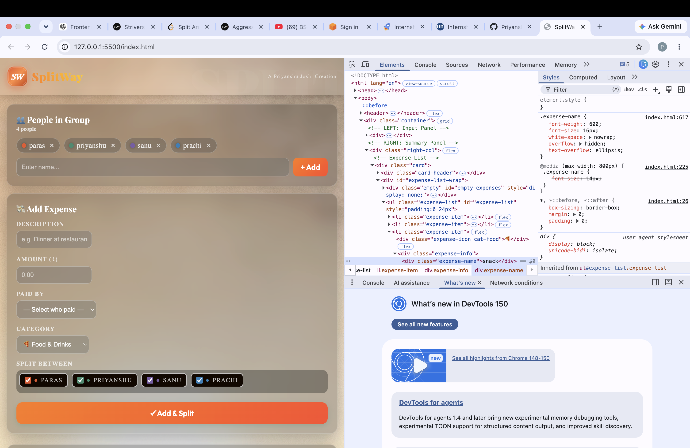

# SplitWay 💸

SplitWay is a responsive expense-splitting web application that makes it easy for groups to track shared expenses, calculate individual balances, and determine who needs to pay whom.

The project was built to practice and strengthen core frontend development skills using HTML, CSS, and JavaScript.

## 🚀 Features

- 👥 Add and remove people from a group
- 💸 Add and track shared expenses
- 🧑‍🤝‍🧑 Split expenses between selected group members
- 💳 Select who paid for each expense
- 📊 Automatically calculate total expenses
- ⚖️ Calculate individual balances
- 💰 Show who owes money and who gets money
- 🔄 Automatically calculate settlement transactions
- 🗑️ Delete individual expenses
- 🧹 Clear all expenses
- 💾 Persist people and expenses using browser Local Storage
- 📱 Responsive design for desktop and mobile devices
- 🎨 Modern glassmorphism-inspired interface
- 🏷️ Expense categories such as Food, Transport, Accommodation, Entertainment, and Other

## 🛠️ Technologies Used

- **HTML5** – Page structure and content
- **CSS3** – Styling, layouts, animations, responsive design, and media queries
- **JavaScript** – Application logic, DOM manipulation, expense calculations, and dynamic rendering
- **Local Storage API** – Persisting people and expense data in the browser

## 📱 Responsive Design

SplitWay is designed to work across different screen sizes.

The layout adapts to smaller screens using CSS media queries, allowing the application to be used comfortably on mobile devices as well as desktop screens.

## 💾 Data Persistence

SplitWay uses the browser's `localStorage` to save:

- Group members
- Expenses

This means the data remains available after refreshing or reopening the page in the same browser.

> **Note:** Data is stored locally in the user's browser and is not stored on a server or shared between different devices.

## 🧮 How Expense Splitting Works

For each expense, the user selects:

1. Expense description
2. Amount
3. Person who paid
4. Expense category
5. People who should share the expense

SplitWay then calculates each person's share and determines their net balance.

The application also generates settlement transactions showing who should pay whom.

## 📂 Project Structure

```text
Splitway/
│
├── index.html
├── bg.avif
└── README.md

## 🎯 Project Goals

This project was created to practice:

- DOM manipulation
- JavaScript functions and arrays
- Event handling
- Dynamic HTML rendering
- Array methods
- JavaScript calculations
- Browser Local Storage
- CSS Grid and Flexbox
- CSS animations
- Responsive web design
- Media queries
- Building a complete frontend project from scratch

## 🔮 Future Improvements

Possible future improvements include:

- User authentication
- Cloud/database storage
- Multiple groups
- Expense editing
- User accounts
- Sharing groups with other users
- Backend API
- Real-time synchronization between devices
- Improved accessibility

## 📸 Screenshots

### Desktop


### Mobile



## 🌐 Live Demo

Coming soon.

## 👨‍💻 Author

**Priyanshu Joshi**

B.Tech Computer Science & Technology Student

Built as a frontend development project to strengthen practical JavaScript and web development skills.

---

⭐ If you find this project useful, feel free to explore the repository and give it a star!